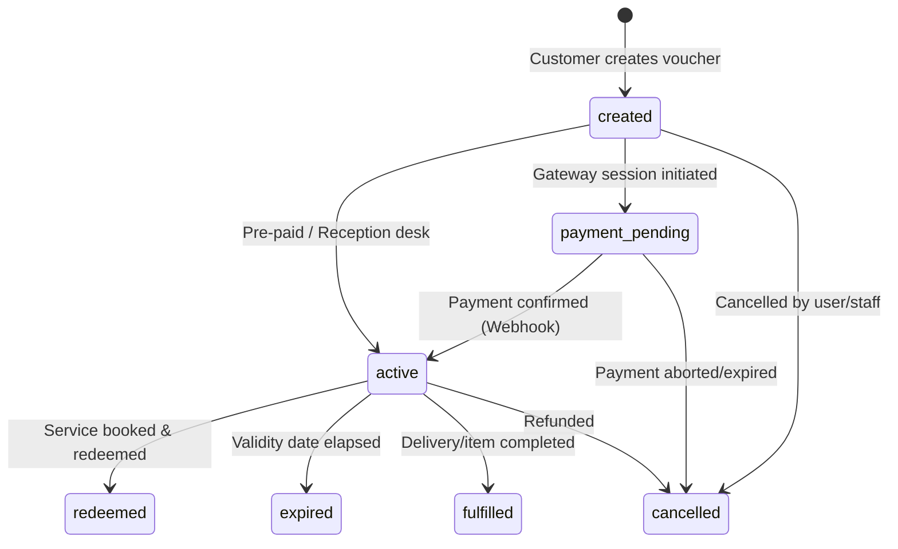
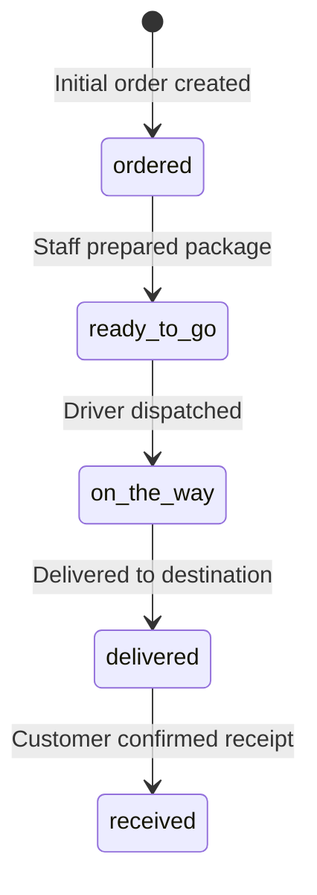

# USH Spa — Gift Voucher API Specification

> **Microservice**: `ushbooknpay`  
> **Base Paths**: `/api/v1/vouchers` (direct) or `/booknpay/api/v1/vouchers` (API Gateway)  
> **Protocol**: HTTPS / REST / JSON  
> **OpenAPI Documentation**: `/docs` or `/redoc`

---

## 1. Overview & Architecture

The Gift Voucher API handles the creation, delivery, verification, and lifecycle management of gift vouchers across three distinct categories:
- **`service`**: Traditional voucher redeemable for a specific spa service.
- **`digital`**: Digital e-gift voucher template configured in `ushauth`.
- **`physical`**: Physical gift package or item requiring delivery tracking.

### Key Capabilities
- **Automated Recipient Provisioning**: When a voucher is gifted to a recipient who does not yet have an account, the backend automatically provisions a customer account in `ushauth`, generates a random 6-digit login password, and sends login credentials via SMS and WhatsApp.
- **Dual State Machines**: Manages both financial voucher status (`created` → `active` → `redeemed`) and physical delivery progression (`ordered` → `ready_to_go` → `on_the_way` → `delivered` → `received`).
- **Public Card View & Secure Verification**: Public gift card page accessible via `public_token` (no authentication), plus a secure unlock endpoint accepting `secret_code`.
- **Multilingual Support**: Delivery status and metadata provide bilingual English and Arabic labels (`delivery_status_label` and `delivery_status_label_ar`).

---

## 2. Authentication & Authorization

| Endpoint Category | Authentication Required | Headers |
|---|---|---|
| **Customer Endpoints** | Customer JWT Bearer | `Authorization: Bearer <customer_jwt>`<br>`USHSPA-TOKEN: <app_token>` |
| **Internal / Staff Endpoints** | Service App Token | `USHSPA-TOKEN: <app_token>` |
| **Public Endpoints** | None (Unauthenticated) | None |

---

## 3. Voucher Lifecycles & State Machines

### 3.1 Voucher Status Lifecycle



**Valid Status Transitions:**
- `created` → `payment_pending`, `active`, `cancelled`
- `payment_pending` → `active`, `cancelled`
- `active` → `redeemed`, `fulfilled`, `expired`, `cancelled`
- `redeemed`, `cancelled`, `expired`, `fulfilled` are terminal states.

### 3.2 Delivery Status Lifecycle

Used for physical vouchers and ordered items. Matches the USH Spa Shop order delivery lifecycle:



**Delivery Statuses & Bilingual Labels:**

| Status Code | English Label | Arabic Label | Allowed Transition To |
|---|---|---|---|
| `ordered` | Ordered | تم الطلب | `ready_to_go` |
| `ready_to_go` | Ready To Go | جاهز للإرسال | `on_the_way` |
| `on_the_way` | On the Way | في الطريق | `delivered` |
| `delivered` | Delivered | تم التوصيل | `received` |
| `received` | Received | تم الاستلام | *(Terminal)* |

---

## 4. Endpoints Reference

### 4.1 Customer Endpoints

#### 1. Create a Gift Voucher
Creates a new voucher. If `recipient_phone` belongs to a non-existent customer, an account is automatically created in `ushauth` and issued a random 6-digit login password.

- **Method / Path**: `POST /api/v1/vouchers/`
- **Auth**: Customer JWT Bearer (`CurrentUser`)
- **Status Code**: `201 Created`

**Request Body (`CreateGiftVoucherRequest`):**

```json
{
  "service_id": "9b1deb4d-3b7d-4bad-9bdd-2b0d7b3dcb6d",
  "total_amount": "45.000",
  "currency": "KWD",
  "gift_category": "physical",
  "ordered_items": [
    {
      "item_id": "prod-101",
      "name": "Luxury Bathrobe & Oil Set",
      "quantity": 1,
      "price": "45.000"
    }
  ],
  "delivery_status": "ordered",
  "delivery_address": {
    "city": "Kuwait City",
    "block": "3",
    "street": "Gulf Road",
    "building": "Tower A",
    "floor": 4,
    "apartment": 12,
    "notes": "Leave at front desk if unavailable"
  },
  "recipient_phone": "+96598765432",
  "recipient_data": {
    "name": "Fatima Al-Ali",
    "email": "fatima@example.com"
  },
  "sender_data": {
    "name": "Sarah Ahmad",
    "phone_number": "+96599123456"
  },
  "gift_message": "Happy Birthday! Enjoy your special spa relaxation.",
  "gift_template": "birthday_gold",
  "expire_date": "2026-12-31T23:59:59Z"
}
```

**Key Request Fields:**
- `service_id` *(UUID, optional)*: Spa service ID being gifted.
- `total_amount` *(Decimal/String, required)*: Total purchase amount (3 decimals for KWD).
- `gift_category` *(string, optional, default: `"service"`)*: `service`, `digital`, or `physical`.
- `ordered_items` *(list[object], optional)*: Itemized snapshots for bundled products/services.
- `delivery_status` *(string, optional)*: Initial delivery state (e.g. `"ordered"`).
- `delivery_address` *(object, optional)*: Structured delivery address JSON.
- `recipient_phone` *(string, optional)*: Phone number in E.164 format (`+965...`).
- `recipient_data` *(object, optional)*: Snapshot of recipient name and email.
- `sender_data` *(object, optional)*: Sender display name and phone number.
- `status` *(string, optional, default: `"created"`)*: `created`, `payment_pending`, or `active`.
- `payment_provider` *(string, optional)*: `MyFatoorah`, `DirectLink`, `Deema`, or `Other`.
- `payment_through` *(string, optional)*: `ushspa` (app/web) or `desk` (reception).

**Response (201 Created):**

```json
{
  "success": true,
  "data": {
    "id": "e4b2d5a1-7c3f-4e89-9a12-8d7e6f5c4b3a",
    "gift_category": "physical",
    "ordered_items": [
      {
        "item_id": "prod-101",
        "name": "Luxury Bathrobe & Oil Set",
        "quantity": 1,
        "price": "45.000"
      }
    ],
    "delivery_status": "ordered",
    "delivery_status_label": "Ordered",
    "delivery_status_label_ar": "تم الطلب",
    "delivery_address": {
      "city": "Kuwait City",
      "block": "3",
      "street": "Gulf Road",
      "building": "Tower A",
      "floor": 4,
      "apartment": 12
    },
    "service_id": "9b1deb4d-3b7d-4bad-9bdd-2b0d7b3dcb6d",
    "service_data": {},
    "branch_id": null,
    "branch_data": {},
    "status": "created",
    "sender_id": "11111111-1111-1111-1111-111111111111",
    "sender_data": {
      "name": "Sarah Ahmad",
      "phone_number": "+96599123456"
    },
    "recipient_phone": "+96598765432",
    "recipient_id": "22222222-2222-2222-2222-222222222222",
    "recipient_data": {
      "name": "Fatima Al-Ali",
      "email": "fatima@example.com",
      "phone_number": "+96598765432"
    },
    "total_amount": "45.000",
    "currency": "KWD",
    "gift_message": "Happy Birthday! Enjoy your special spa relaxation.",
    "gift_template": "birthday_gold",
    "secret_code": "829104",
    "public_token": "a1b2c3d4e5f6789012345678abcdef01",
    "expire_date": "2026-12-31T23:59:59Z",
    "created_at": "2026-09-18T20:00:00Z",
    "updated_at": "2026-09-18T20:00:00Z"
  }
}
```

---

#### 2. List My Received Vouchers
Returns all vouchers where the authenticated customer's phone number matches `recipient_phone`.

- **Method / Path**: `GET /api/v1/vouchers/my-vouchers/`
- **Auth**: Customer JWT Bearer
- **Query Parameters**:
  - `status` *(string, optional)*: Filter by status (`active`, `redeemed`, `expired`, `available`).
  - `available_only` *(bool, optional)*: If `true`, returns only active, non-expired vouchers.
  - `service_id` *(UUID, optional)*: Filter by service.
  - `branch_id` *(UUID, optional)*: Filter by branch.
  - `from_date` / `to_date` *(ISO date, optional)*: Filter by creation date range.
  - `page` *(int, default: 1)*: Page number.
  - `page_size` *(int, default: 20, max: 100)*: Items per page.

**Response (200 OK):**

```json
{
  "count": 1,
  "next": null,
  "previous": null,
  "results": [
    {
      "id": "e4b2d5a1-7c3f-4e89-9a12-8d7e6f5c4b3a",
      "gift_category": "physical",
      "ordered_items": [...],
      "delivery_status": "on_the_way",
      "delivery_status_label": "On the Way",
      "delivery_status_label_ar": "في الطريق",
      "status": "active",
      "total_amount": "45.000",
      "currency": "KWD",
      "sender_data": { "name": "Sarah Ahmad" },
      "recipient_phone": "+96598765432",
      "secret_code": "829104",
      "public_token": "a1b2c3d4e5f6789012345678abcdef01",
      "expire_date": "2026-12-31T23:59:59Z"
    }
  ]
}
```

---

#### 3. List My Sent Vouchers
Returns all vouchers purchased and gifted by the authenticated customer (`sender_id == current_user.sub`).

- **Method / Path**: `GET /api/v1/vouchers/my-sent-vouchers/`
- **Auth**: Customer JWT Bearer
- **Query Parameters**: Same as `my-vouchers`.

**Response (200 OK):** Paginated array of `GiftVoucherResponse` objects.

---

#### 4. Get Voucher Detail (Sender or Admin)
Returns the complete voucher detail. Only accessible by the sender who purchased the voucher or an admin with `USHSPA-TOKEN`.

- **Method / Path**: `GET /api/v1/vouchers/{voucher_id}/`
- **Auth**: Customer JWT Bearer or `USHSPA-TOKEN`
- **Response (200 OK)**: Full `GiftVoucherResponse`.
- **Errors**: `403 Forbidden` if requester is neither the sender nor admin; `404 Not Found` if voucher does not exist.

---

### 4.2 Public Endpoints (No Authentication Required)

#### 1. Public Gift Card Page
Retrieves public-facing gift card information using the 32-character `public_token`. The sensitive `secret_code` and sender's phone number are deliberately **omitted** for privacy and security.

- **Method / Path**: `GET /api/v1/vouchers/public/{public_token}/`
- **Auth**: None
- **Response (200 OK):**

```json
{
  "success": true,
  "data": {
    "id": "e4b2d5a1-7c3f-4e89-9a12-8d7e6f5c4b3a",
    "gift_category": "physical",
    "ordered_items": [
      {
        "item_id": "prod-101",
        "name": "Luxury Bathrobe & Oil Set",
        "quantity": 1,
        "price": "45.000"
      }
    ],
    "delivery_status": "ready_to_go",
    "delivery_status_label": "Ready To Go",
    "delivery_status_label_ar": "جاهز للإرسال",
    "delivery_address": {
      "city": "Kuwait City",
      "block": "3"
    },
    "service_id": "9b1deb4d-3b7d-4bad-9bdd-2b0d7b3dcb6d",
    "status": "active",
    "sender_data": {
      "name": "Sarah Ahmad"
    },
    "total_amount": "45.000",
    "currency": "KWD",
    "gift_message": "Happy Birthday! Enjoy your special spa relaxation.",
    "gift_template": "birthday_gold",
    "public_token": "a1b2c3d4e5f6789012345678abcdef01",
    "expire_date": "2026-12-31T23:59:59Z",
    "created_at": "2026-09-18T20:00:00Z"
  }
}
```

---

#### 2. Verify Secret Code & Unlock Details
Allows the recipient to enter their 6-digit `secret_code` on the public gift card page. When verified against `public_token`, unlocks and returns the full voucher details.

- **Method / Path**: `POST /api/v1/vouchers/public/{public_token}/`
- **Auth**: None
- **Request Body (`VerifyVoucherSecretCodeRequest`):**

```json
{
  "secret_code": "829104"
}
```

**Response (200 OK):**
Returns the full `GiftVoucherResponse` object (identical to `GET /{voucher_id}/`).

**Error Responses:**
- `400 Bad Request`: `{"detail": "Invalid secret code."}` (code mismatch)
- `404 Not Found`: `{"detail": "Gift voucher not found."}` (invalid token)

---

### 4.3 Internal & Staff Endpoints

#### 1. Update Gift Voucher (Full / Partial)
General update endpoint for updating voucher details including service, arrangement, duration, pricing, sender/recipient metadata, delivery information, payment details, and lifecycle status.

- **Method / Path**: `PATCH /api/v1/vouchers/{voucher_id}/` or `PUT /api/v1/vouchers/{voucher_id}/`
- **Auth**: `USHSPA-TOKEN: <app_token>`

**Request Body (`UpdateGiftVoucherRequest`):**
Any combination of the following fields:

```json
{
  "gift_message": "Enjoy your luxurious day at the spa!",
  "total_amount": "55.000",
  "extra_time": 30,
  "recipient_phone": "+96598765432",
  "recipient_data": {
    "name": "Fatima Al-Ali",
    "email": "fatima@example.com"
  },
  "delivery_status": "ready_to_go",
  "delivery_address": {
    "city": "Salmiya",
    "block": "4",
    "street": "Amman St"
  },
  "status": "active",
  "payment_id": "100624710000000255",
  "payment_provider": "MyFatoorah",
  "payment_through": "ushspa"
}
```

**Response (200 OK):** Full `GiftVoucherResponse`.

**Errors:**
- `404 Not Found`: If the gift voucher does not exist.
- `422 Unprocessable Entity`: Attempted illegal status transition or invalid delivery state transition.

---

#### 2. Update Voucher Status (Lifecycle / Payment / Booking)
Called by payment webhooks when payment completes, or by the booking service upon voucher redemption.

- **Method / Path**: `PATCH /api/v1/vouchers/{voucher_id}/status/`
- **Auth**: `USHSPA-TOKEN: <app_token>`

**Request Body (`UpdateGiftVoucherStatusRequest`):**

```json
{
  "status": "active",
  "payment_id": "100624710000000255",
  "payment_provider": "MyFatoorah",
  "payment_through": "ushspa",
  "payment_url": "https://portal.myfatoorah.com/knet/100624710000000255",
  "payment_data": {
    "invoiceId": "100624710000000255",
    "paymentMethod": "KNET",
    "transactionStatus": "SUCCESS"
  },
  "delivery_status": "ordered"
}
```

**For Redemption (`status: "redeemed"`):**

```json
{
  "status": "redeemed",
  "booking_id": "3c983a45-6677-4488-9900-112233445566",
  "redeemed_by": "22222222-2222-2222-2222-222222222222",
  "booking_data": {
    "booking_reference": "BK-2026-9901",
    "appointment_date": "2026-09-25T14:00:00Z"
  }
}
```

---

#### 2. Update Voucher Delivery Status (Employee / Public with Secret Code)
Advances the physical delivery state of the voucher or gift basket. Validates allowable transitions using the `DeliveryStateMachine`.

- **Method / Path**: `PATCH /api/v1/vouchers/{voucher_id}/delivery-status/` (also mounted at `PATCH /booknpay/api/v1/vouchers/{voucher_id}/delivery-status/`)
- **Auth & Permissions**:
  1. **Employee Request**: Requester is an employee/staff with status update permission (via `Authorization: Bearer <jwt>`, employee role, or gateway headers `X-User-Type`, `X-Permissions`). Secret code is *not* required in request body.
  2. **Public Request**: Caller provides `X-USHSPA-TOKEN` (or `USH_TOKEN`) in header AND the voucher's `secret_code` in request body.
- **Status Code**: `200 OK`

**Request Body (`UpdateVoucherDeliveryStatusRequest`):**

```json
{
  "status": "",
  "delivery_status": "ready_to_go",
  "note": "Package assembled and handed to courier",
  "secret_code": "829104"
}
```

*Note: The request body is sent directly at root level (not wrapped in `body`). You can specify either `delivery_status` or `status`. `secret_code` is required for public requests and optional for employees with status update permission.*

**Allowed State Transitions:**
1. `ordered` → `ready_to_go`
2. `ready_to_go` → `on_the_way`
3. `on_the_way` → `delivered`
4. `delivered` → `received`

**Response (200 OK):** Full `GiftVoucherResponse` with updated `delivery_status`, `delivery_status_label`, and `delivery_status_label_ar`.

**Errors:**
- `400 Bad Request`: `Invalid secret code.` (when public request provides incorrect secret code).
- `401 Unauthorized`: Missing `USH_TOKEN` / `X-USHSPA-TOKEN` header on public request.
- `403 Forbidden`: Employee lacks status update permission, or public request is missing `secret_code`.
- `404 Not Found`: Gift voucher not found.
- `422 Unprocessable Entity`: Attempted invalid state transition (e.g. jumping from `ordered` directly to `delivered`).

---

#### 3. List All Vouchers (Service / Public with Token)
Returns all vouchers across the platform without filtering by customer or creator. Supports comprehensive filtering.

- **Method / Path**: `GET /api/v1/vouchers/` (also mounted at `GET /booknpay/api/v1/vouchers/`)
- **Auth**: `USH_TOKEN: <token>` (or `USH-TOKEN`, `X-USH-TOKEN`, `X-USHSPA-TOKEN`, or query param `?ush_token=<token>`)
- **Query Parameters**:
  - `status` *(string, optional)*: Filter by voucher lifecycle status (`created`, `payment_pending`, `active`, `redeemed`, `cancelled`, `expired`).
  - `delivery_status` *(string, optional)*: Filter by delivery state (`ordered`, `ready_to_go`, `on_the_way`, `delivered`, `received`).
  - `gift_category` *(string, optional)*: Filter by gift category (`service`, `digital`, `physical`).
  - `expire_date` *(string, optional)*: Filter by expiration date (e.g. `2026-12-31` or full ISO datetime).
  - `created_at` *(string, optional)*: Filter by creation date (e.g. `2026-09-19` or full ISO datetime).
  - `payment_through` *(string, optional)*: Filter by payment/sales channel (`ushspa`, `desk`).
  - `sender_id` *(UUID, optional)*: Filter by sender UUID.
  - `service_id` *(UUID, optional)*: Filter by service UUID.
  - `page` *(int, default: 1)*: Page number.
  - `page_size` *(int, default: 1000, max: 5000)*: Items per page (defaults to 1000 to return all vouchers).

**Response (200 OK):** Paginated `make_paginated_response` containing `GiftVoucherResponse` objects.

---

#### 4. Admin: List All Vouchers
Comprehensive, paginated listing endpoint for back-office administration and USH Desk.

- **Method / Path**: `GET /api/v1/vouchers/admin/`
- **Auth**: `USHSPA-TOKEN: <app_token>`
- **Query Parameters**:
  - `status` *(string, optional)*: Filter by voucher status (`created`, `payment_pending`, `active`, `redeemed`, `cancelled`, `expired`).
  - `delivery_status` *(string, optional)*: Filter by delivery state (`ordered`, `ready_to_go`, `on_the_way`, `delivered`, `received`).
  - `gift_category` *(string, optional)*: Filter by gift category (`service`, `digital`, `physical`).
  - `expire_date` *(string, optional)*: Filter by expiration date (`YYYY-MM-DD` or ISO datetime).
  - `created_at` *(string, optional)*: Filter by creation date (`YYYY-MM-DD` or ISO datetime).
  - `payment_through` *(string, optional)*: Filter by payment/sales channel (`ushspa`, `desk`).
  - `sender_id` *(UUID, optional)*: Filter by sender.
  - `service_id` *(UUID, optional)*: Filter by service.
  - `page` *(int, default: 1)*: Page number.
  - `page_size` *(int, default: 20, max: 100)*: Results per page.

**Response (200 OK):** Paginated `make_paginated_response` containing `GiftVoucherListItem` records.

---

## 5. Summary Table of All Voucher Endpoints

| Method | Endpoint | Auth | Target Audience | Description |
|---|---|---|---|---|
| `POST` | `/api/v1/vouchers/` | JWT Bearer | Customers | Create a gift voucher (service/digital/physical) |
| `GET` | `/api/v1/vouchers/my-vouchers/` | JWT Bearer | Customers | List vouchers received by requester |
| `GET` | `/api/v1/vouchers/my-sent-vouchers/` | JWT Bearer | Customers | List vouchers sent by requester |
| `GET` | `/api/v1/vouchers/{voucher_id}/` | JWT / USHSPA-TOKEN | Sender / Admin | Get full voucher details (includes secret code) |
| `PATCH` / `PUT` | `/api/v1/vouchers/{voucher_id}/` | USHSPA-TOKEN | Staff / Admin | Update gift voucher details (partial or full) |
| `GET` | `/api/v1/vouchers/public/{public_token}/` | None | Public | Public gift card page (masked secret code) |
| `POST` | `/api/v1/vouchers/public/{public_token}/` | None | Public | Verify secret code and unlock voucher details |
| `PATCH` | `/api/v1/vouchers/{voucher_id}/status/` | USHSPA-TOKEN | Services / Webhook | Update voucher lifecycle status |
| `PATCH` | `/api/v1/vouchers/{voucher_id}/delivery-status/` | Employee JWT / (Secret code + USH_TOKEN) | Employee / Public | Advance physical delivery lifecycle (employee or secret code) |
| `GET` | `/api/v1/vouchers/` | USH_TOKEN / USHSPA-TOKEN | Internal Services / Apps | List all vouchers with filters (category, delivery status, dates, payment channel) |
| `GET` | `/api/v1/vouchers/admin/` | USHSPA-TOKEN | Backoffice Admin | Admin paginated voucher search with filters |

---

## 6. SQS Domain Events

When voucher state transitions occur, the transactional outbox dispatches domain events to AWS SQS:

| Event Type | Event Class | Trigger Condition | Key Payload Fields |
|---|---|---|---|
| `voucher.active` | `VoucherActiveEvent` | Status changes to `active` (payment success) | `id`, `public_token`, `secret_code`, `recipient_phone`, `gift_category`, `ordered_items`, `delivery_status`, `delivery_address`, `recipient_data` (includes `password` if auto-provisioned) |
| `voucher.payment_pending` | `VoucherPaymentPendingEvent` | Payment gateway session started | `id`, `public_token`, `payment_id`, `payment_url` |
| `voucher.redeemed` | `VoucherRedeemedEvent` | Voucher applied to confirmed booking | `id`, `booking_id`, `redeemed_by`, `redeemed_at` |
